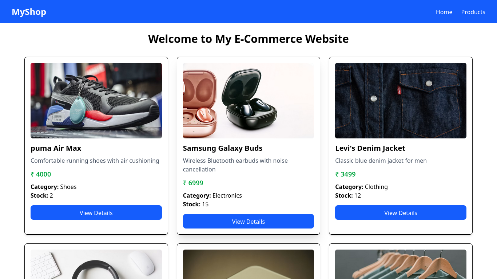
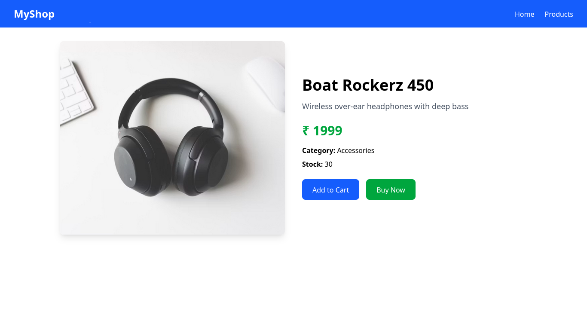
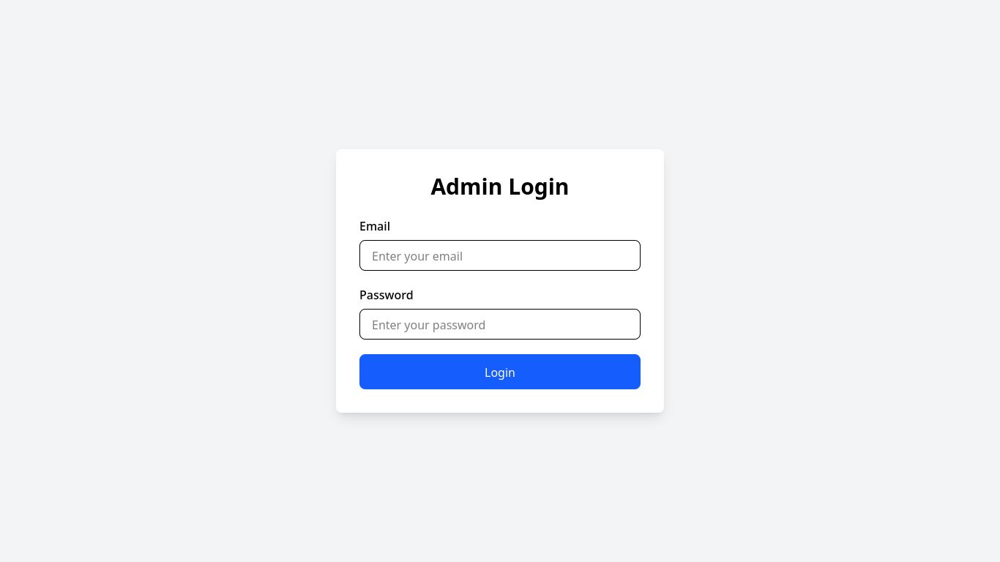

# 🛒 MERN E-Commerce Project

A full-stack e-commerce web application built using the MERN stack.

This project is being developed with separate applications for the **Admin** and **User** sides, including dedicated frontend and backend services.

> 🚧 **Project Status:** Currently under development — approximately 60% completed.

---

## 📌 Project Overview

This e-commerce application is designed with a separate architecture for the Admin and User sides.

The project currently contains:

- Admin Frontend
- Admin Backend
- User Frontend
- User Backend

The goal is to build a complete e-commerce platform where administrators can manage products and users can browse and purchase products.

---

## 🏗️ Project Structure

```text
ecommerce-project/
│
├── admin-backend/
│   ├── src/
│   │   ├── config/
│   │   ├── controllers/
│   │   ├── middleware/
│   │   ├── models/
│   │   └── routes/
│   ├── server.js
│   └── package.json
│
├── admin-frontend/
│   ├── src/
│   │   ├── components/
│   │   ├── layouts/
│   │   └── pages/
│   ├── public/
│   └── package.json
│
├── user-backend/
│   ├── src/
│   │   ├── config/
│   │   ├── controllers/
│   │   ├── models/
│   │   └── routes/
│   ├── server.js
│   └── package.json
│
├── user-frontend/
│   ├── src/
│   │   ├── components/
│   │   ├── pages/
│   │   └── services/
│   ├── public/
│   └── package.json
│
├── .gitignore
└── README.md

```

---

## 📸 Screenshots

### 🏠 User Home / Product Listing



### 📦 Product Details



### 🔐 Admin Login



---

## 🚀 Tech Stack

### Frontend
- React.js
- JavaScript
- HTML
- CSS
- Vite

### Backend
- Node.js
- Express.js
- MongoDB
- Mongoose

### Tools
- Git
- GitHub
- VS Code
- Postman


---

## 👨‍💼 Admin Side

The Admin panel is used to manage the products and other administrative operations of the e-commerce application.

### Current Features

- Admin Login
- Admin Authentication
- Protected Routes
- Admin Dashboard
- Product Listing
- Add Product
- Edit Product
- Product Management
- Product API integration


---

## 🛍️ User Side

The User panel is designed for customers to browse and explore products.

### Current Features

- Product Listing
- Product Cards
- Product Details
- Product API Integration
- MongoDB Product 


---

## ⚙️ Backend Architecture

The backend applications are organized using a modular structure to keep the code clean and maintainable.

```text
src/
│
├── config/
├── controllers/
├── middleware/
├── models/
└── routes/

Main Backend Responsibilities
REST API development
MongoDB database connection
Product management APIs
Authentication and authorization
Request handling through controllers
Route management
Authentication middleware


---

## 🗄️ Database

MongoDB is used as the database for this e-commerce application.

The backend uses MongoDB to store and manage application data such as:

- Products
- Admin information
- User-related data

Mongoose is used to define schemas and interact with MongoDB from the backend.


---

## ⚙️ Installation

Clone the repository:

```bash
git clone https://github.com/Sarfraz-Ahmad-it/mern-ecommerce-project.git

Navigate to the project:

cd mern-ecommerce-project

Install dependencies separately for each application:

Admin Backend
cd admin-backend
npm install

Admin Frontend
cd ../admin-frontend
npm install

User Backend
cd ../user-backend
npm install

User Frontend
cd ../user-frontend
npm install


---

## 🔐 Environment Variables

Create a `.env` file inside the backend directories and add the required environment variables.

Example:

```env
MONGO_URI=your_mongodb_connection_string
JWT_SECRET=your_jwt_secret
PORT=5000